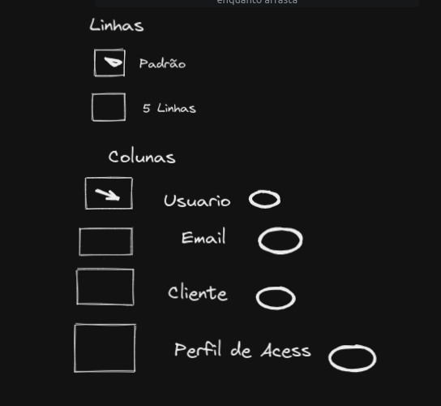
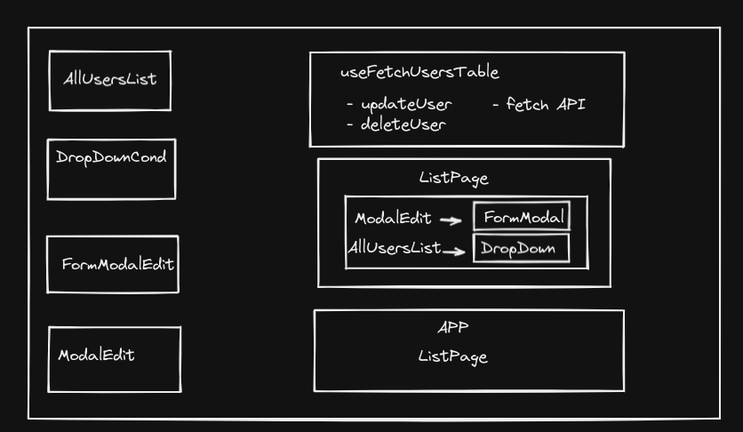

# `Alibin Clients Table - FrontEnd`

Esse projeto tem como propor uma solução aplicavél ao desafio apresentado no processo seletivo da empresa Alibin

## Conteúdo

 - [Visão Geral](#Visão)

## O Desafio

Desenvolver uma tela que renderiza uma tabela com dados de possíveis clientes, ao clicar no ícone no canto superior direito, renderiza um checkbox clicável que controla quais colunas e linhas devem aparecer.
Bem como os ícones de editar, edita um cliente e excluir, apaga o cliente da respectiva linha.


### Protótipo do Dropdown



### Estrutura base dos Componentes utilizados



### Processo de Criação

### `Ferramentas Utilizadas`
 - HTML5 markup
 - Bootstrap and ReactBootstrap
 - React
 - Typescript
 - Heroku

### Links

- URL : [Links](https://alibin-challenge.herokuapp.com/)


### Aprendizados

Este processo foi muito desafiador, porém consegui exercer meus aprendizados e exercitar novas formas de solucionar problemas.

codehiglight:

```ts
export const UsersProvider = ({ children }: IUsersProviderProps) => {
  const [usersList, setUsersList] = useState<IUser[]>(() => {
    const storagedUsers = localStorage.getItem('users');
    if (storagedUsers) {
      return JSON.parse(storagedUsers);
    }
    return [];
  });
  const [name, setName] = useState<boolean>(false);

  useEffect(() => {
    fetch('https://jsonplaceholder.typicode.com/users')
      .then((response) => response.json())
      .then((data) => {
        if (usersList.length === 0) setUsersList(data);
      });
  }, []);

  function updateUser(editedUser: IEditUserProps) {
    const updatedUsersList = [...usersList];
    const userExists = updatedUsersList.find(
      (user) => user.id === editedUser.id
    );
    if (userExists) {
      userExists.name = editedUser.name;
      userExists.email = editedUser.email;
      userExists.company.name = editedUser.companyName;
      userExists.website = editedUser.website;
      setUsersList(updatedUsersList);
      localStorage.setItem('users', JSON.stringify(updatedUsersList));
    }
  }

  function deleteUser(id: string) {
    const updatedUsersList = [...usersList];
    const userIndex = updatedUsersList.findIndex((user) => user.id === id);
    if (userIndex >= 0) {
      updatedUsersList.splice(userIndex, 1);
      setUsersList(updatedUsersList);
      localStorage.setItem('users', JSON.stringify(updatedUsersList));
    }
  }
  ```

### Autor

-Linkedin - [Arthur Bernardo Messias](https://www.linkedin.com/in/arthur-bernardo-messias/)
